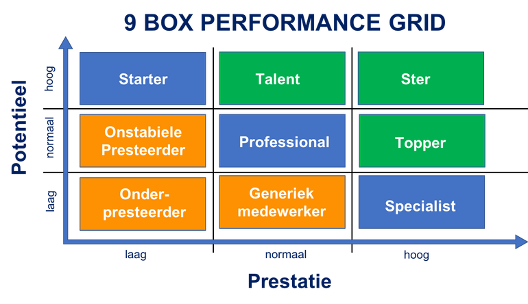

# Winc Academy FEO Opdrachten

## Winc Academy Front-end Class may 2020

In deze Pepositorie staan opdrachten van de Front End Opleiding van Winc Academy - Class of may 2020

---

## Curriculum

De opleiding is gebaseerd op de methodiek van Project Based Learning en bestaat uit de domeinen CRAFT, PROGRESS en TEAM. We leren mensen niet alleen programmeren, maar ook hoe ze samen moeten werken en hoe ze tot een eindresultaat kunnen komen.

---

Vanaf de start worden de studenten **wekelijks** **beoordeeld** en delen we hun ontwikkel-punten op basis van het 9-box-performance grid. Deze evaluatie momenten leiden tot:

- feedback & goalsetting voor de 'oranje blokken'
- coaching & stretching voor de 'groene blokken'

Aan het einde van week 3 en week 4 is een go/ no go moment.

Na 6 weken krijgen de kandidaten een finale beoordeling. Als ze niet slagen, dan gaan ze (nog) niet aan de slag.

---

## Week 1: Webdevelopment, een introductie

- System setup
- HTML5
- Git en Github
- UI
- CSS3
- Duo opdracht

## Week 2: User eXperience en interactie

- User Story Mapping
- Refinement
- UX
- Vanilla JavaScript
- Feature Testing
- LinkedIn aanmaken / bijwerken
- Individual Assignment

## Week 3: Het RESTful web

- Feedback ontvangen
- Projectwerk
- APIs en webcommunicatie
- Unit testing
- Databases

## Week 4: Frontend frameworks

- Feedback geven
- React
- Presenteren
- Coaching geven en ontvangen
- CV + LinkedIn + Github bijwerken

## Week 5: Patronen en paradigma's

- Online communicatie
- Paradigma's: Functional Programming, Object Oriented
- Software patronen
- Refactoren
- State Management (ex: redux)
- Peer 2 Peer feedback

## Week 6: Het moderne web en eindopdracht

- Moderne browser APIs
- Performance
- Native apps
- Final assignment

Kijk hier voor een [gedetailleerd 6 weken plan](https://www.notion.so/c41c297ffed441c0bca0a608399b9769)

---